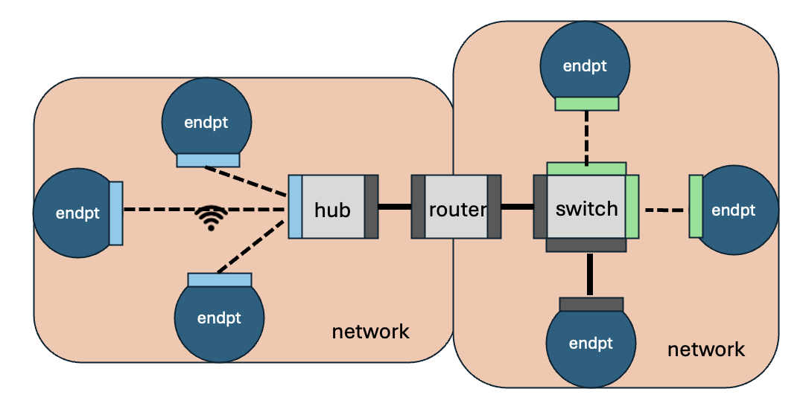
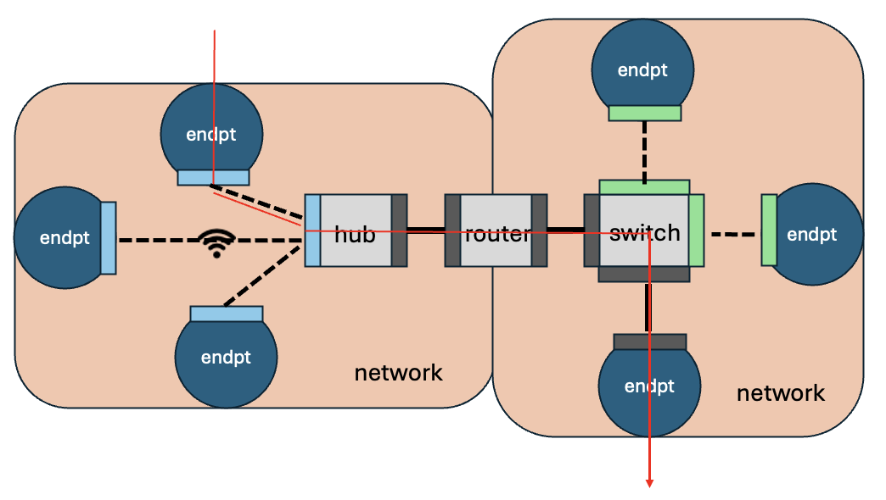

# mrnes

Multi-resolution network emulation-simulation

#### Overview

The multi-resolution network emulator/simulator (**mrnes**) is a Go package for modeling communication networks.  Its level of model abstraction is considerably higher than network simulators like ns3 or OpNet, for its intended use cases emphasize speed and scale of model evaluation more than quantitative predictive accuracy.  An **mrnes** model has components that represent various kinds of entities found in a complex system: routers, bridges, routers, repeaters, hub, switches, hosts, servers, sensors.  The configuration files read in at start-up identify the components being used,  their interconnections, and performance characteristics (like bandwidth) they are assigned to have.   A **mrnes** network simulates the transition of traffic between endpoints, and models the impact that contention for resources has on that traffic.   

##### Network Connectivity

Before getting into the details of **mrnes** models and simulation it is helpful to understand elements of "The Big Picture" that **mrnes** has of networks, their devices, and how connectivity is expressed.

There are five kinds of network objects: network, endpoint, router, switch, and interface.  Routers route and switches switch, but in the current version of **mrnes** there is functionally little difference between them.    An endpoint is a device on which some kind of computation may occur.   This definition can be broad, encompassing simple devices that merely sense their environment and report to data collectors, to powerful servers with multiple CPUs and the ability to concurrently run many applications.

Every interface is bound to one device, and 'faces' one network.   It has performance characteristics such as bandwidth, and (optionally) buffer size.   The interface has a 'media type', either "wired" or "wireless".   In the case of a wired interface it may be declared to directly connect through a cable to some other wired interface (on a different device) that faces the same network.   It may instead be declared to be 'connected' to a list of other interfaces that face the same network, without directly specifying cable connections. The intent here is to express that somehow the devices to which these interfaces are bound are reachable through the network, but the mechanics of the reachability aren't explicit, and during the simulation the latency  communications between those interfaces are derived from declared characteristics of the network rather than from the single cable.   

Any device may have multiple interfaces;  when it does, typically each interface is bound to a different network; we say the interface is 'facing' the network.  For descriptive purposes a network is categorized as having LAN, WAN, T3, T2, or T1 scale.  These characterizations are not used by **mrnes** in any way, but as descriptions they can help explain the structure of a **mrnes** model.   Networks connect to each other a router that has one interface facing one of the networks, and a different interface facing the other.    All of a switch's interfaces face the same network, but like a router, and endpoint can stradle multiple networks.   

A network is declared to have a 'media type', presently either "wired" or "wireless".    A wireless network must have a router serving as a hub, with a wireless interface facing the network.  The hub facilitates communication between endpoints with wireless interfaces that face the network.  Every wireless interface maintains a list of other wireless interfaces facing the same network with which it can directly communicate.  That list will always contain reference to the hub's wireless interface,  there are no assumptions or requirements on what other interfaces may be referenced in any one of these.   That is left to the user's model configuration.   

As with cable-free wired communications, the latency (and packet drop) characteristics of a wireless communication between interfaces depends on the characteristics of the interfaces themselves, and those of the wireless network.

The figure below illustrates some of these points.

The network on the left is wireless.  The three endpoints all have wireless interfaces connected to the hub's wireless interface. The hub has a cable connection to the router that spans the two networks.  It has cabled interface facing the right-side network that connects to a switch. That switch has another cabled interface to one endpoint, and non-cabled wired interfaces connecting to two other endpoints.

##### Simulation

The **mrnes** package does not contain the definition of components that generate and receive network traffic, these must be supplied by code that imports the **mrnes** package (e.g., various components of the **pces** package). That code passes to an **mrnes** API method (**mrnes.EnterNetwork**) a description of a communication, specifying (among other things) the names of the source and destination devices identified.  **mrnes** uses ordinary text to name endpoints and exports these names.   While a model may be constructed to ascribe IP or MAC addresses to device interfaces, these are not assumed.    Routing through the assembled system is performed using a shortest-path discovery algorithm.   More sophisticated (and realistic) routing algorithms can in principle be incorporated, but this requires modification to the existing **mrnes** code base.

Computational endpoints in **mrnes** can be configured to have multiple cores.  This means that the end-to-end time involved in meeting a computation request depends on the number of available cores at the instant of the request.    The code making the request will have acquired the model of the CPU and will have looked up in a table the execution time of the task on that model, but it is left to **mrnes** logic to manage the assignment of computation workload to cores and to manage reporting back to calling code when the computation is completed,  a time that may reflect some queueing.

**mrnes** is designed and verified to accurately capture simple workflows, using measured execution times for computation and communication activities.    When those workflows specify pretty much all of the activity actually going on in a testbed setting, **mrnes** does a good job of making performance predictions that are aligned with measured performance.  **mrnes** also provides mechanisms to cause the performance of those workflows to vary as a function of system loading factors.  Models that use these loading factors should be viewed more as a way of scoping the *possible* impact of load factors on that performance more than an accurate quantitative prediction of the loading factors.

Consider the figure below, illustrating the presentation of a message to an **mrnes** representation of an endpoint.  The representation comes from code and memory space outside of **mrnes**.   The simulation discovers the route, creates a frame, and passes the frame through a sequence of interfaces and networks until it reaches the destination host, at which point the message carried by the frame is passed back out.  The core activity of the network simulation is carried out by discrete event handlers that process the frame as it arrives at the ingress interface of a device, is processed by the device (i.e. switched or routed), is processed by the egress interface of the device, and then passes through network infrastructure to be presented at the ingress interface of the next device.   We will describe the actions of the event handlers in more detail later.   At this point the key things to remember are that the addressing scheme is left to the modeler, that the route is computed (or recovered) as a shortest path at the point the frame is presented to the source, that the time advancement logic assumes that the passage of a frame through a network between two interfaces is no faster than the slower of the two interfaces, and that this passage time reflects the impact that network congestion has on latency and bandwidth.  **mrnes** leaves to the modeler decisions of what to do when traffic is lost due to contention,  providing that user with a means of receiving notice of the network location and simulation time when such loss occurs.

##### Background flows and background computation

A unique feature of **mrnes** is its support for concurrent simulation of network components at different levels of resolution.   The point of the design is to enable a modeler to include the impact that computation and communication *other* than that of particular interest has on the workflows of interest, by including their use of network and computational resources, against which the foreground activity competes.

Foreground computation requests are presented to an **mrnes** endpoint, which queues them if needed to be served by a free CPU core.   **mrnes** allows a model to specify a background rate and per-request computation demand at an endpoint, and have that flow occupy cores, under the covers so to speak.  In the presence of background computation the requests for foreground computation are more likely to have to wait for a free core.

Background flows can be introduced to cause foreground frames to have to compete for bandwidth, and so slow down communication.   **mrnes** defines an API for describing attributes of these background flows.  In all cases the effect of background flows at an interface is to induce foreground frames to  queue for transmission through the interface, using a delay model based on the aggregate background flows through it.  The level of intensity of background computation and background flows can be dynamically changed in the course of a simulation run, by the model code that uses the **mrnes** package.

##### API

The API for **mrnes** input files is given in [**mrnes**-API](#https://github.com/ITI/mrnes/blob/main/docs/MRNES-API.pdf) .

##### **mrnes** Internals

More detailed documentation of how **mrnes** operates is provided in [**pces**-Internals.pdf](#https://github.com/ITI/pces/blob/main/docs/PCES-Internals.pdf)

#### The PCES/MRNES System

The Patterned Computation Evaluation System (PCES) and Multi-resolution Network Emulator and Simulator (MRNES) are software frameworks one may use to model computations running on distributed system with the focus on estimating its performance and use of system resources.

The PCES/MRNES System is written in the Go language.  We have written a number of GitHub repositories that support this system, described below.

- https://github.com/iti/evt/vrtime .  Defines data structures and methods used to describe virtual time.
- https://github.com/iti/rngstream .  Implements a random number generator.
- https://github.com/iti/evt/evtq . Implements the priority queue used for event management.
- https://github.com/iti/evt/evtm . Implements the event manager.
- https://github.com/iti/evt/mrnes . Library of data structures and methods for describing a computer network.
- https://github.com/iti/evt/pces .  Library of data structures and methods for modeling patterned computations and running discrete-event simulations of those models.
- https://github.com/iti/evt/pcesbld . Repository of tool **xlsxPCES** used for describing PCES/MRNES models and generating input files used to run simulation experiments.
- https://github.com/iti/evt/pcesapps . Repository of PCES/MRNES example models, and scripts to generate and run experiments on those models.

Copyright 2025 Board of Trustees of the University of Illinois.
See [the license](LICENSE) for details.

