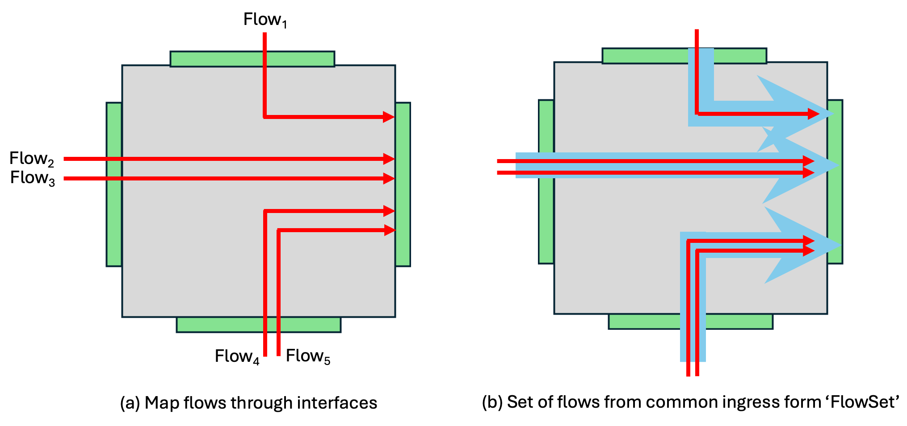

### **mrnes** Internals

(Last update May 17, 2025)

**mrnes** is not a stand-alone network simulator.   It is a library of data types, global variables, and methods that are accessible to a Go program that imports *github.com/iti/mrnes*.    So the first topic in a description of **mrnes** internals is a description of its interface to that program.

#### Initialization

The **mrnes** framework expects variables to be initialized using model descriptions contained in the three files 'topo.yaml', 'exp.yaml', and 'devExec.yaml' described in the [**mrnes** API document](#https://github.com/iti/mrnes/MRNES-API.pdf) .  Methods for reading these files and performing the initializations are part of the **mrnes** interface.

Four method calls are involved in assembling an **mrnes** model from the various input files.  These calls are made in the base simulation program that organizes the model.  

- **mrnes.CreateTraceManager(name string, use bool)** is a constructor returning a pointer to a data structure used to store and organize trace records that are gathered as the simulation runs.  'name' is a label applied to the data structure, and 'use' is a flag that selects or inhibits collection of trace records. 
- **mrnes.LoadTopo(filename string, idCounter int, traceMgr *TraceManager) error'**reads the file specified with the path 'filename' (nominally, 'topo.yaml'), expecting a YAML file in the format expected of 'mrnes.TopoCfg' structs.   Succeeding it builds internal representations of the topology objects, and gives each a unique integer identifier whose least value is given as 'idCounter'. The pointer 'traceMgr' is included so that as these objects are built, the association between them, their names, and the identifier is recorded in the data structure that manages collected trace records.  An error is returned if the read process fails.
- **mrnes.LoadDevExec(filename string) error** reads the file specified with the path 'filename'  (nominally, 'devExec.yaml'), expecting a YAML file in the format expected of 'mrnes.DevExecList' struct.  Succeeding in creating a stucture in that format,  it sets the global pointer **devExecTimeTbl** to the pointer returned, and thereafter device operation execution time lookups are performed using this table.  If the read does not succeed an error is returned.
- **mrnes.LoadStateParams(defaults string) error** reads the file 'defaults' as a YAML file in the format expected of 'mrnes.ExpCfgDict' structs for configuration parameters (nominally, 'exp.yaml'). Success results in the parameters read being prioritized as described later in this document, and used to create and initialize the 'state' structs of each of the topology objects.  If any step in this process fails an error is returned.

When using  [**pces**](#https://github.com/iti/pces),  if the controlling go program adheres to the command-line argument specification described in the [**pces** API](#https://github.com/iti/pces/PCES-API.pdf), it may call method 'pces.ReadSimArgs()' to acquire the input files and properly call these methods.

An example 'main.go' file (from the 'embedded' application https://github.com/ITI/pcesapps/tree/main/embedded/sim-dir/main) is given below.  See [PCES-Apps.pdf](#https://github.com/ITI/pcesapps/blob/main/docs/PCES-Apps.pdf) for details.

```
package main
import (
    "github.com/iti/evt/evtm"
    "github.com/iti/evt/vrtime"
    "github.com/iti/pces"
    "path/filepath"
)

func main() {
    pces.ReadSimArgs()
    pces.RunExperiment(expCntrl, expCmplt)
}
```


#### Running a model

The **mrnes** package works in tandem with some external code base that imports it, and then uses the API to assemble a model as sketched above. Typically that program will build the model and layer it on top of it a description of some application layer workflow.   When the workflow requires the network to carry an application layer message between hosts it will call the **mrnes.EnterNetwork** method (see below), which schedules event handlers that ultimately lead to scheduling of an event handler in the non-**mrnes** code base to receive the message and metadata about its passage.

Methods of particular interest to the modeler when running a model include

- **func (np *NetworkPortal) EndptDevModel(devName, accelName string) string** .  A **pces** modeler sees the mapping file which binds **pces** functions to endpoints found in the network topology.  Specification of the device model on that endpoint are needed for the **pces** model to look up its execution time. This method provides that description of the CPU. Exactly one of the two arguments is non-empty, which indicates whether the timing sought is for a device or for an accelerator.
- **func (np *NetworkPortal) EnterNetwork(evtMgr *evtm.EventManager, srcDev, dstDev string, msgLen int, connDesc *ConnDesc, IDs NetMsgIDs, rtns RtnDescs, requestRate float64, msrID int, msg any) (int, float64, bool)** . This method is called to request the network simulator to transport a message.  The meaning of the input parameters are
  - 'evtMgr'  points to the data structure organizing all the discrete events, both in **mrnes** and in the modeler's program that calls 'EnterNetwork'.
  - 'srcDev', 'dstDev' are the names of the endpoints in the **mrnes** topology serving as the source and destination of the message.
  - 'msgLen' gives the length of the message to be carried, in bytes.
  - 'connDesc' points to a structure that holds description of the message as defined by the **mrnes** structure 'ConnDesc'.  The structure has enumerated constants (defined by **mrnes** ) that describe the type of the connection (e.g. a discrete packet or a flow), identification of how latency will be approximated (e.g. direct simulation, or a particular kind of quantitative approximation), and (in the case of a flow) whether the flow is being set up, torn down, or having its requested bitrate changed).
  - 'IDs' is a structure carrying particular identifiers for the requested connection that are used by the simulator.
  - 'rtns' is a structure holding pointers to **mrnes** structures of type 'RtnDesc', each of which holds parameters needed to schedule an event.  Each structure holds the parameters for different driving circumstances, include when the message is finally delivered, and optionally, in the case of a flow, to report to the specified event handlers if the flow's bitrate is forced to change, and optionally, if the packet is dropped during transmission.
  - 'requestRate' is a bitrate the source requests for a background flow.  Note, it may not receive the entire rate, depending on the type of the flow (elastic or inelastic), and the state of the network at the time of the request.  We will later elaborate on the elasticity of flows; here, it suffices to say that if a flow is inelastic and the requested flow rate cannot be supported, the flow is not established and the  Boolean return value from 'EnterNetwork' is false.  If the flow is established the float64 return value is the allocated bandwidth and the Boolean flag is true.
  - 'msrID' is an identity of a measure being taken by the transit of the message.
  - 'msg' carries a structure that the modeler wishes to have conveyed by the network from the srcDev to the dstDev. **mrnes** makes no assumptions about this struct, it just delivers it.


To formulate a call to **mrnes.EnterNetwork** a modeler needs access to certain **mrnes** defined enumerated constants and structures.

##### RtnMsgStruct

```
// RtnMsgStruct formats the report passed from the network to the
// application calling it
type RtnMsgStruct struct {
    Latency float64     // span of time (secs) from srcDev to dstDev
    Rate    float64     // minimum available bandwidth encountered during transit
    PrLoss  float64     // est. prob. of drop in transit
    DevIDs  []int       // list of ids of devices visited on transition of network
    Msg     any         // msg introduced at EnterNetwork
}
```

At the point the simulator realizes that the message it is carrying has reached the destination and should passed back to the calling application, it creates an instance of  'RtnMsgStruct' to hold a description of the message delivery. 'Msg' carries the struct passed to the simulator in the 'EnterNetwork' call.  'Latency' gives the measured (or approximated) length of time (in seconds) between the message being introduced at the source and being delivered at the destination.  'Rate' gives the observed minimum bandwidth allocated to the message anywhere along its route. 'PrLoss' gives an approximation of the probability of the packet being dropped anywhere along the route, based on formulaes from queueing theory.  

**RtnDesc**

```
// RtnDesc holds the context and event handler for scheduling a return
type RtnDesc struct {
  Cxt any
  EvtHdlr evtm.EventHandlerFunction
```

A call to the 'evtm.EventManager' event scheduler requires specification of some (general) context (often a pointer to some structure that describes the entity to which the event will be applied), and a function that satisfies the required signature.  A modeler creates instances of 'RtnDesc' structures to populate an instance of the 'RtnDescs' structure.

**RtnDescs**

```
// RtnDescs hold four RtnDesc structures, for four different use scenarios.
type RtnDescs struct {
    Rtn *RtnDesc
    Src *RtnDesc
    Dst *RtnDesc
    Loss *RtnDesc
}   
```

The 'Rtn' pointer is used to schedule report of the completion of the message delivery to the destination, along with an instance of 'RtnMsgStruct'. 'Src' and 'Dst' labeling indicate that they be used to notify a message's source and destination in the case of a triggering event (like changes in flow bitrates). Likewise the 'Loss' structure is used to report when there is a packet loss.

**ConnType**

```
type ConnType int
const (
    FlowConn ConnType = iota
    DiscreteConn        
)
```

Traffic is tagged as being a flow or being a discrete packet. 

**ConnLatency**

```
type ConnLatency int
const (
    Zero ConnLatency = iota
    Place
    Simulate
)
```

The latency of a message transfer can be modeled one of three ways. 'Zero' means it is instaneous.  This makes sense for the establishment and changes to flow whose time-scales for existence or rate changing are large compared to the 'real' time scale of network communication.   'Place'  means that the message is placed directly at the destination without performing discrete events at network devices, using a non-zero latency approximation based on analysis of the network state.  Choice of 'Place' latency trades off detail in model exploration with computational speed, in part because it ignores changes in the network state that might occur between sending and receiving.  'Simulate' means the message traversal will be simulated in the usual way of discrete-event simulation, passing from device to device along its route.

**FlowAction**

```
// FlowAction describes the reason for the flow message, that it is starting, ending, or changing the request rate
type FlowAction int             
const (
    None FlowAction = iota
    Srt        
    Chg 
    End
)   
```

'FlowAction' has meaning for background flow connections, indicating whether they start, end, or are changing the bitrate.  The 'None' value is used when the connection is not a flow.

 **ConnDesc**

```
type ConnDesc struct { 
    Type ConnType
    Latency ConnLatency
    Action FlowAction
}   
```

ConnDesc holds characteristics of a connection...the type (discrete or flow), the latency (how delay in delivery is ascribed) and in the case of a flow, the action (start, end, rate change).

**NetMsgIDs**

```
type NetMsgIDs struct {
    ExecID int      // execution id, from application
    FlowID int      // flow id, when a flow
    ConnectID int   // connection id, unique per network connection
}
```

A call to 'EnterNetwork' carries a collection of identifiers.   'ExecID' is an identity that the program using **mrnes** can persist with a message through passages through multiple network segments.  For example, **pces** defines Computational Patterns and message flows between Funcs assigned to  Computational Patterns.   A Computational Pattern may describe a work flow that defines a message transition from Func to Func to Func, sometimes crossing network segments.   All the messages involved in a packet's workflow might have the same 'ExecID' identifier.  When a network message is related to a flow,  'FlowID' is its identifier. 'ConnectID' is a unique identifier given to every request to establish a new association between some srcDev and dstDev.  It is possible for a connection established by an 'EnterNetwork' call to be used more than once, and so after **mrnes**  creates the connectionID and returns to the 'EnterNetwork' caller,  a later call can refer to that connection by including its ID in the 'ConnectID' field.

'func (np *NetworkPortal) Depart(evtMgr *evtm.EventManager, devName string, nm NetworkMsg)' is called when the network message 'nm' reaches its destination.  'devName' gives the Name of the endpoint to which the message is being delivered. The message carries indexing information that 'Depart' uses to look up the identity of the event handler to call, stored previously in a 'RtnDesc' structure.  The 'data' included in the scheduled return is a structure of type 'RtnMsgStruct', and so (as described earlier) includes observed latency, available bandwidth, and estimated packet loss along the path from source to destination.

#### Flows

**mrnes** gives a modeler the ability to describe coarse-level traffic demands on the network, demands that can be expressed as a flow of bits rather than a sequence of packets..   The basic idea is to allow a modeler to compare the performance of applications of particular interest whose foreground traffic is modeled directly with packets in different operating contexts.   Using background traffic a modeler can describe operating scenarios where the application of interest is competing for network resources in an context where the network is overloaded, is heavily loaded, or has a medium or light load. The foreground traffic is impacted by increased queuing for passage through device interfaces, and increased latency and diminished throughput through more abstract network specifications.

**mrnes** offers a the notion of a 'Flow'.  There are three variants.  One is that the flow is a steady stream of explicitly formulated packets, in case that level of detail is needed.  The other two variants do not explicitly form packets, but describe the flow in terms of an aggregate bit rate of an imaginary stream of packets.  One of these variants is 'elastic' in the sense that the flow rate may change dynamically, the other variant is 'inelastic' in the sense that once established, the flow rate does not change.The model code that uses **mrnes** can create such flows and attempt to ascribe to them particular bandwidth values.

The **mrnes** function that creates a background flow is 

```
func func CreateFlow(srcDev string, dstDev string, requestRate float64, frameSize int, 
		mode string, execID int, groups []string)
```

The function arguments are

- 'srcDev', 'dstDev': text names for the source and destination endpoints for the flow if successfully created.
- 'requestRate':  the requested bitrate (in Mbps) of the flow
- 'frameSize': the number of bytes in flow packet's frame, meaningful when mode is 'pckt'
- 'mode':  one of 'pckt', 'inelastic-flow', 'elastic-flow'
- 'execID': an identitity
- 'groups': a list of tags useable by model code to differentiate between flows.

After all the flows are built, and as part of starting the simulation, one should call 

```
func StartFlows(evtMgr *evtm.EventManager)
```

where the argument is the event list manager.  After that, the flows are self-managing.    One can stop all the flows (e.g. at the end of the simulation) by calling

```
func StopFlows(evtMgr *evtm.EventManager)
```

#### Event Processing

##### Model of task execution

A simulation program that imports **mrnes** can advance simulation time by including scheduling the execution some task---defined by that program and with an execution requirement defined by that program---on an endpoint declared to be part of an **mrnes** model.   The **mrnes** data structure representing the endpoint has a task scheduling data structure 'mrnes.TaskScheduler' with method 

```
Schedule(evtMgr *evtm.EventManager, op string, req, pri, timeslice float64, context any, msg any, execID, objID int, complete evtm.EventHandlerFunction) bool 
```

The input variables are

- 'evtMgr': event list manager 
- 'op': text description of the task whose execution is model, defined by the calling code, returned when the task completes, and is not interpreted by **mrnes**.
- 'req': the total length of simulation time associated with the task execution, in units of seconds.
- 'pri': a queuing priority value used if the task must wait for a free core.  The larger the priority value, the higher the priority.
- 'timeslice': the execution requirement can be broken up into separately scheduled timeslices, each with length 'timeslice', in units of seconds.
- 'context', 'msg': 'any' parameters that are included in the task description and used as arguments when the event reporting the task completion is scheduled.   These are not interpreted by **mrnes**.
- 'execID', 'objID': identities that have meaning to the program calling this method, included to be part of   trace reports that the scheduler can generate.   These are not interpreted by **mrnes**.
- 'complete' is the function to schedule at the simulation time when the task's execution is completed.

When 'Schedule' is called it first looks for the presence of a free core.  If one is present an event is scheduled, either 'complete' to report the completion of the task, or an event handler internal to **mrnes** if the timeslice epoch is smaller than the service requirement of the task. If no cores are present the task is queued.  Whenever a task is queued for service the selection key is 1.0/((now-arrivalTime)^{1/2}*pri).  When a core becomes free the next task given service is one with the least selection key. This measure is meant to prioritize tasks with higher priority, but try and forestall starvation by including the effect of aging in the selection.

Notice that if no background computation is specified and if only one priority level is used, the queuing behavior for access to free cores is FCFS.

##### Model of communication 

Packets are presented to **mrnes** for communication using method **mrnes.EnterNetwork**, described earlier.  A result of that call is to schedule an immediate execution of the **mrnes.enterEgressIntrfc** method.   That method enqueues the message for transmission across the interface, and if the message arrives to an empty queue, computes the time the message starts to be served.  This need not be immediately, for if there are background flows passing through that interface in the same direction, the arriving message may be delayed by a model that estimates queuing the arrival would incur owing to as-yet-unserved imaginary flow 'packets' that arrived earlier.  Method **mrnes.enterIntrfcService** is scheduled to execute at the time such queuing---if any---has completed.   This event handler computes the delay the message has passing through the interface as a function of the message length, and interface speed, and schedules method **mrnes.exitEgressIntrfc** to execute on completion of the transfer.   This latter event computes a message latency to the next interface on the message's route.  There are two ways this computation may be performed.   If it happens that the topology model declares that there is a cable between those two interfaces, there is then a 'time-on-wire' delay associated with traversing that cable which serves as the latency.   If there is no cable, the computation estimates the latency as being the mean 'time in system' of an M/D/1 queue, where the 'arrival rate' is the sum of the rates of all Flows departing the egress interface with the rates of all Flows entering the next interface on the route; the deterministic delay is the time required to serve the message as a function of its length and the declared bandwidth of the network being traversed. Event handler **mrnes.enterIngressIntrfc**  is scheduled to execute at the end of the trans-network latency period.   If it happens that there is another message enqueued at the original interface, **mrnes.enterIntrfcService** is scheduled to execute.  This scheduling may include a delay that models servicing imaginary flow packets at the interface that arrived between when the message now leaving the original interface started being served, and the present time.

Execution of event handler **mrnes.enterIngressIntrfc** is similar to that of **mrnes.enterEgressIntrfc**. The message is enqueued at the interface, and execution of **mrnes.enterIntrfcService** is scheduled if the message arrives to an empty queue.   After service is given to the message, the event handler **mrnes.arriveIngressIntrfc** is scheduled to execute.  Here, if the interface is attached to an **mrnes** Endpoint, the message is passed back up to the application layer using **mrnes** by calling the network portal method **Depart**, described earlier.  Otherwise the delay of the message through the device is computed.  This delay depends on the model of device through which the message is passing, the length of the message, and (critically) an operation code.   For both switches and routers there are default operation codes, nominally 'switch' and 'route', but it is possible for a modeler to define others, and to integrate into their model additional processing (and different delays) to occur when processing a non-default code.   This has particular benefit in modeling security technology that adds computations as messages pass through switches or routers. Details are provided in [User-Extensions](#https://github.com/ITI/pcesapps/blob/main/docs/User-Extensions.pdf) .

**mrnes.enterEgressIntrfc** is scheduled to execute immediately.

##### Model of Flow processing

When a Flow's mode is 'packet' the simulator sets up a stream of messages to run continuously, each of which looks like a message sent by an application and is handled as though it were a message from an application.   The endpoint named as the Flow's srcDev originates the messages, and each is directed to the endpoint named as the flow dstDev.  Packets in the Flow compete for bandwidth at interfaces with packets generated by applications, and so introduce additional queueing delays for the application packets that otherwise would not have been present.  The rate established for the Flow has units of Mbits/sec.   The route established for the srcDev -> dstDev flow starts at one of srcDev's network interfaces, and the Flow's packets are issued from that interface.    The inter-arrival time between packets is random, G*S, where S is the time required for one packet of FrameSize bytes to pass through the interface, and G is a geometically distributed random variable with success probability p equal to the ratio of the Flow's rate to the interface's bandwidth.  Packets that are generated this way are tagged, and upon reaching the endpoint named by dstDev are dropped. 

When a Flow's mode is either 'elastic-flow' or 'inelastic-flow' there are no concrete packets generated.   The timing model is built to represent a Flow's packet arrivals and their consumption of bandwidth at interfaces.  As a Flow is defined and its end-to-end bit rate is established, every interface on the route from the Flow's srcDev to dstDev is tagged with the Flow's identity and its bitrate.  As illustrated by the Figure below in (a), the egress side of a device interface can identity a 'FlowSet' of all flows that arrive at the the device through a common ingress interface, and are directed to the egress interface. Figure side (b) illustrates that we




aggregate all Flows through a device that share the ingress and egress interfaces as a 'FlowSet'.  Foreground packets that arrive to the device through the same ingress interface would be serialized,  the interface admits only one at a time.   In this then the egress interface sees no difference (statistically) between a Flow whose bit rate is the sum of the Flows in a FlowSet and individual treatment of those Flows.   Our flow model discretizes the potential arrival times of imagined packets in a FlowSet to occur at epochs of the service time that would be required by the egress interface to push a packet FrameSize bytes large through the interface, call that S.  The timing model is then like having packet movement clocked at discrete points in time, S units of time apart.   In this model, every FlowSet may present one or zero packets to the egress interface each time-step.   We denote the total number of packets so presented at the $n^{th}$ step by the variable $A_n$.    We assume the inter-arrival times of packets from flows in the same FlowSet are like those when the Flow mode is 'packet': random, G*S where G is geometrically distributed with success probability equal to the ratio of the sum of the FlowSet's Flow's bitrates to the egress interface bandwidth.  This makes $A_n$ random as well.   One can compute the number of imagined flow packets in the system after completing the $n^{th}$ time-step by $Q_n = \max\{0, Q_{n-1}+A_n -1\}$.  

The device passes foreground packets through itself, and foreground packets may queue up for transmission through an interface.  We apply the model of imagined background flow packets at the instant we have a foreground packet P that is ready for transmission according to the queueing rules of foreground traffic,  but might receive an additional delay waiting for the transmission of as-yet-untransmitted imaginary flow packets that arrived at the interface before the foreground traffic.   Importantly, this means that the $A_n$ random variables are sampled on demand, within the context of a simulating a device placing a foreground packet into service, and does not involve or depending any sampling associated with those same Flows passing through previous devices.  The parameters of the sampling depend on the Flows' accepted bitrates only, and the device's egress interface bandwidth.  We compute this additional flow-induced delay by sampling all the $A_i$ since the time that the last foreground packet was served up until the point P is ready to be transmitted, and using the recursion on $Q_n$ compute the number of flow packets still enqueued at the interface at the instant that P is ready for transmission.  If that number is non-zero the transmission of P is delayed for at least as many time-steps as there are flow packets enqueued.   If there are arrivals from FlowSets to the egress at that same instant, under the assumption among currently arriving packets the order of processing is uniformly randomized, it may be that P is delay (perhaps even further) because one or more of the imagined flow packets is served before it.   In any case, the flow model gives us a rational means of quantifying how background flows can consume resources and induce queuing delay into the forwarding of foreground traffic.

