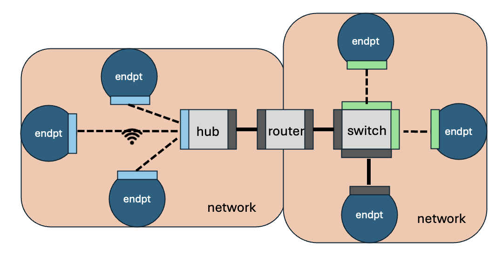
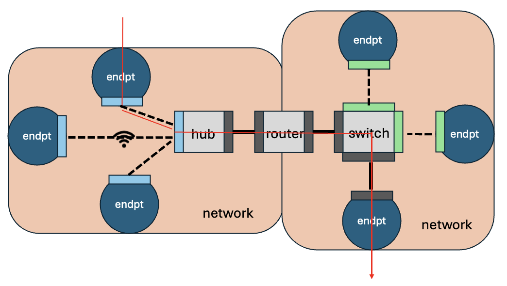

### Multi-Resolution Network Emulator/Simulator (mrnes)

(Last update March 26, 2025)

#### 1. Overview

The multi-resolution network emulator/simulator (**mrnes**) is a Go package for modeling communication networks.  Its level of model abstraction is considerably higher than network simulators like ns3 or OpNet, for its intended use cases emphasize speed and scale of model evaluation more than quantitative predictive accuracy.  An **mrnes** model has components that represent various kinds of entities found in a complex system: routers, bridges, routers, repeaters, hub, switches, hosts, servers, sensors.  The configuration files read in at start-up identify the components being used,  their interconnections, and performance characteristics (like bandwidth) they are assigned to have.   A **mrnes** network simulates the transition of traffic between endpoints, and models the impact that contention for resources has on that traffic.   

##### 1.1 Network Connectivity

Before getting into the details of **mrnes** models and simulation it is helpful to understand elements of "The Big Picture" that **mrnes** has of networks, their devices, and how connectivity is expressed.

There are five kinds of network objects: network, endpoint, router, switch, and interface.  Routers route and switches switch, but in the current version of **mrnes** there is functionally little difference between them.    An endpoint is a device on which some kind of computation may occur.   This definition can be broad, encompassing simple devices that merely sense their environment and report to data collectors, to powerful servers with multiple CPUs and the ability to concurrently run many applications.

Every interface is bound to one device, and 'faces' one network.   It has performance characteristics such as bandwidth, and (optionally) buffer size.   The interface has a 'media type', either "wired" or "wireless".   In the case of a wired interface it may be declared to directly connect through a cable to some other wired interface (on a different device) that faces the same network.   It may instead be declared to be 'connected' to a list of other interfaces that face the same network, without directly specifying cable connections. The intent here is to express that somehow the devices to which these interfaces are bound are reachable through the network, but the mechanics of the reachability aren't explicit, and during the simulation the latency  communications between those interfaces are derived from declared characteristics of the network rather than from the single cable.   

Any device may have multiple interfaces;  when it does, typically each interface is bound to a different network; we say the interface is 'facing' the network.  For descriptive purposes a network is categorized as having LAN, WAN, T3, T2, or T1 scale.  These characterizations are not used by **mrnes** in any way, but as descriptions they can help explain the structure of a **mrnes** model.   Networks connect to each other a router that has one interface facing one of the networks, and a different interface facing the other.    All of a switch's interfaces face the same network, but like a router, and endpoint can stradle multiple networks.   

A network is declared to have a 'media type', presently either "wired" or "wireless".    A wireless network must have a router serving as a hub, with a wireless interface facing the network.  The hub facilitates communication between endpoints with wireless interfaces that face the network.  Every wireless interface maintains a list of other wireless interfaces facing the same network with which it can directly communicate.  That list will always contain reference to the hub's wireless interface,  there are no assumptions or requirements on what other interfaces may be referenced in any one of these.   That is left to the user's model configuration.   

As with cable-free wired communications, the latency (and packet drop) characteristics of a wireless communication between interfaces depends on the characteristics of the interfaces themselves, and those of the wireless network.

The figure below illustrates some of these points.



The network on the left is wireless.  The three endpoints all have wireless interfaces connected to the hub's wireless interface. The hub has a cable connection to the router that spans the two networks.  It has cabled interface facing the right-side network that connects to a switch. That switch has another cabled interface to one endpoint, and non-cabled wired interfaces connecting to two other endpoints.

##### 1.2 Simulation

The **mrnes** package does not contain the definition of components that generate and receive network traffic, these must be supplied by code that imports the **mrnes** package (e.g., various components of the **pces** package). That code passes to an **mrnes** API method (**mrnes.EnterNetwork**) a description of a communication, specifying (among other things) the names of the source and destination devices identified.  **mrnes** uses ordinary text to name endpoints and exports these names.   While a model may be constructed to ascribe IP or MAC addresses to device interfaces, these are not assumed.    Routing through the assembled system is performed using a shortest-path discovery algorithm.   More sophisticated (and realistic) routing algorithms can in principle be incorporated, but this requires modification to the existing **mrnes** code base.

Computational endpoints in **mrnes** can be configured to have multiple cores.  This means that the end-to-end time involved in meeting a computation request depends on the number of available cores at the instant of the request.    The code making the request will have acquired the model of the CPU and will have looked up in a table the execution time of the task on that model, but it is left to **mrnes** logic to manage the assignment of computation workload to cores and to manage reporting back to calling code when the computation is completed,  a time that may reflect some queueing.

**mrnes** is designed and verified to accurately capture simple workflows, using measured execution times for computation and communication activities.    When those workflows specify pretty much all of the activity actually going on in a testbed setting, **mrnes** does a good job of making performance predictions that are aligned with measured performance.  **mrnes** also provides mechanisms to cause the performance of those workflows to vary as a function of system loading factors.  Models that use these loading factors should be viewed more as a way of scoping the *possible* impact of load factors on that performance more than an accurate quantitative prediction of the loading factors.

Consider the figure below, illustrating the presentation of a message to an **mrnes** representation of an endpoint.  The representation comes from code and memory space outside of **mrnes**.   The simulation discovers the route, creates a frame, and passes the frame through a sequence of interfaces and networks until it reaches the destination host, at which point the message carried by the frame is passed back out.  The core activity of the network simulation is carried out by discrete event handlers that process the frame as it arrives at the ingress interface of a device, is processed by the device (i.e. switched or routed), is processed by the egress interface of the device, and then passes through network infrastructure to be presented at the ingress interface of the next device.   We will describe the actions of the event handlers in more detail later.   At this point the key things to remember are that the addressing scheme is left to the modeler, that the route is computed (or recovered) as a shortest path at the point the frame is presented to the source, that the time advancement logic assumes that the passage of a frame through a network between two interfaces is no faster than the slower of the two interfaces, and that this passage time reflects the impact that network congestion has on latency and bandwidth.  **mrnes** leaves to the modeler decisions of what to do when traffic is lost due to contention,  providing that user with a means of receiving notice of the network location and simulation time when such loss occurs.




##### 1.3 Background flows and background computation

A unique feature of **mrnes** is its support for concurrent simulation of network components at different levels of resolution.   The point of the design is to enable a modeler to include the impact that computation and communication *other* than that of particular interest has on the workflows of interest, by including their use of network and computational resources, against which the foreground activity competes.

Foreground computation requests are presented to an **mrnes** endpoint, which queues them if needed to be served by a free CPU core.   **mrnes** allows a model to specify a background rate and per-request computation demand at an endpoint, and have that flow occupy cores under the covers so to speak.  In the presence of background computation the requests for foreground computation are more likely to have to wait for a free core.

Background flows can be introduced to cause foreground frames to have to compete for bandwidth, and so slow down communication.   **mrnes** defines an API for describing attributes of these background flows.  In all cases the effect of background flows at an interface is to induce foreground frames to  queue for transmission through the interface, using a delay model based on the aggregate background flows through it.  The level of intensity of background computation and background flows can be dynamically changed in the course of a simulation run, by the model code that uses the **mrnes** package.

##### 1.4 API

The **mrnes** API has eight basic components.

- Description of input files (`topo.yaml`, `exp.yaml`) that describe topology and architectural performance parameters.
- A set of APIs for golang methods used assemble data structures holding descriptions of network objects, and transform these into the input files needed to assemble a model.
- A method `mrnes.CreateTraceManager` that creates in **mrnes** memory space a data structure used by code in **mrnes** and in code that obtains access to that data structure and uses it to accumulate trace information about a simulation experiment.    All the methods of the trace manager are part of the API.
- Methods `mrnes.LoadTopo`, `mrnes.LoadDevFile`, and `mrnes.LoadStateParams` that are called from the main simulation program to read in the input files and initialize internal data structures in preparation for a simulation run.
- A method `endpt.EndptState.Schedule` for an **mrnes** 'endpoint' (host, server, sensor, any device that simulates the execution of some program in the overall model) for submitting a description of computational workload whose execution requirements are defined in code that calls this method.
- A method `mrnes.CreateBckgrndFlow` for creating a 'background flow' that consumes network resources, and by doing so impacts the performance behavior of foreground application workflows that have greater specificity.   A created flow can be removed calling `mrnes.RmBckgrndFlow`.
- A method `mrnes.EnterNetwork` for presenting a message to the network for communication.
- Definition of the data structure returned to the program that called **mrnes.Enternetwork** when the message is delivered.

##### 1.5 Tracing

**mrnes** can gather traces at essentially every discrete event handler executed, and collate those belonging to the same workflow.  These traces are available upon completion of an execution run, and are useful in understanding where/why performance measurements are not of the scale expected.   **mrnes** supports easy instrumentation to selectively turn trace measurements at specific points (or of specific types) on or off.

#### 2. mrnes API

An **mrnes** modeler interacts with the package through methods defined by an **mrnes** struct named `NetworkPortal`, using structs also defined by **mrnes**. The methods, types, and structs below are all given in Go, as a modeler who is building an application that uses the **mrnes** package will be defining and using these entities from an application written in Go.

##### 2.1 Format of topo.yaml dictionaries

Before speaking to use of **mrnes** methods to build input files, we describe first what **mrnes** expects the topology input file (nominally topo.yaml) to contain.  The descriptions below are of dictionaries defined in TopoCfg, using YAML-like notation. **mnres** accepts JSON descriptions as well, so the definitions are to the largest extent identifying the key-value associations one finds in both YAML and JSON.  Note also that brackets [ ] denote a list, and what we provide below are labels we define in the Appendix [Identity Sets](#Appendix: Identity Sets).   The highest level description of the contents of topo.yaml is the `TopoCfg` dictionary below.   It is simply a name (for reference purposes), then lists of descriptions of networks, routers, endpoints, and switches that make up the overall model.

**TopoCfg**

```
name: string
networks: [NetworkDesc]
routers: [RouterDesc]
endpts: [EndptDesc]
switches: [SwitchDesc]
flows: [FlowDesc]
```

Next we drill down into more detailed descriptions of these network objects.

**NetworkDesc**

A **mrnes** network description lists the string-valued identifiers of all the devices (endpoints, routers, switches) it encompasses.  It has an key `netscale` whose value inexactly describes its size (e.g., "LAN", "WAN", "T3"), and a key `mediatype` whose value describes the physical media (e.g., "wired", "wireless").  The methodologies for initializing parameters of networks and devices may refer to modeler-defined "groups", e.g., indicating that the base basewidths for all networks belonging to group "UIUC" is 1000 Mbps.  A network may belong to any number of groups the model includes.

```
name: NETWORKNAME
groups: [GROUPNAME]
netscale: NETSCALE
mediatype: MEDIA
endpts: [ENDPTNAME]
routers: [ROUTERNAME]
switches: [SWITCHNAME]
```

**EndptDesc**

In **mrnes** we use a general description of an "endpoint" to refer to any device that is performing computation.   It might be a low-powered host or even lower-powered sensor, or may be an enterprise server.   From the **mrnes** point of view the important thing is that it is a platform for executing computations and that it connects to at least one network.   The processing simulated at an endpoint depends on the number of cores that are assumed to be in use (as the model supports parallel execution of computational tasks) and so the description names the number of cores.   An endpoint may have one or more hardware accelerators for specific computations, the EndptDesc includes a dictionary that maps the name of accelerator to the model type. The endpoint has at least one network interface, possibly more, and so the EndptDesc includes a list of interface descriptions. Finally, the model of the CPU used by the Endpt is given, as this is needed when looking up the execution times of computations performed on that Endpt.

```
name: ENDPTNAME
groups: [GROUPNAME]
model: CPUMODEL
cores: int
accel:  map[ACCELNAME]ACCELMODEL
interfaces: [IntrfcDesc]
```

**RouterDesc**

Like a NetworkDesc, a RouterDesc has a unique name identifier, a list of groups the modeler declares the router to belong to,  and a descriptor of the router's model.   It also includes a list of descriptions of the network interfaces attached to the device.

```
name: ROUTERNAME
groups: [GROUPNAME]
model: ROUTERMODEL
interfaces: [IntrfcDesc]
```

**SwitchDesc**

The attributes of a SwitchDesc are identical to those of a RouterDesc.

```
name: SWITCHNAME
groups: [GROUPNAME]
model: SWITCHMODEL
interfaces: [IntrfcDesc]
```

**IntrfcDesc**

The interface description dictionary includes keys whose values identify the device type and instance to which it is attached, the name and type of media of the network to which it is attached.  Like other components of a network it carries a list of group names the model may refer to when configuring parameters for the interface in the run-time representation.

```
name: string
groups: [GROUPNAME]
devtype: DEVTYPE
mediatype: MEDIATYPE
device: DEVNAME
cable: INTRFCNAME
carry: [INTRFCNAME]
wireless: [INTRFCNAME]
faces: NETNAME
```

Exactly one of the values of keys `cable`, `carry`, and `wireless` attributes is non-empty.   In the case of the interface being connected to a wireless network the `wireless` list includes the names of all the interfaces also on that network that a transmission from the interface may directly reach.  If instead the interface connects to a wired network, the **mrnes** view is that the interface may be directly connected through a cable to some other interface, and if that is the case the `cable` attribute names that interface.   **mrnes** allows also the declaration that the media is wired, but that the level of detail in the model does not include declaration of cables and the interfaces they connect, but does allow one to name another interface on that same network to which transmissions are forwarded.  The declared `mediatype` is currently either 'wired' or 'wireless', but we anticipate use cases where other types of media, e.g., 'satellite', might be included.  A list of interfaces that are directly reachable in the same network is named by the value of the  `carry` key.

Finally, the name of the network the interface touches is expressed in the value of the `faces` key.

##### 2.2 Building model files

**mrnes** model files contain a lot of necessary detail.  In this section we describe the definition of those files, and identify some methods **mrnes** supplies so that a Go programmer can write Go programs to build those files.    It is also possible to use software tools that enable a modeler to specify model details in a different form and have that tool transform the model so expressed into the input files we describe here.   [xlsxPCES](#github.com/iti/pcesbld) is one such tool, where **mrnes** and **pces** models are described using an Excel spreadsheet.   This is actually a preferred method for models that are small enough to be expressed without the use of a programming language (where scripts assemble the model files).   Documents [xlsxPCES.pdf](#https://github.com/ITI/pcesbld/blob/main/docs/xlsxPCES.pdf) and [RunningPCES.pdf](#https://github.com/ITI/pcesapps/blob/main/docs/RunningPCES.pdf) describe this approach in detail.

Still, the xlsxPCES approach has limitations, and so **mrnes** package includes methods that are useful in creating the input file that describe the system topology (nominally called topo.yaml), the file that describes system performance parameters (nominally called exp.yaml0, and the file holding descriptions (nominally called devExec.yaml).  We describe these methods below. 

###### 2.2.1 topo.yaml

An individual topology is a collection of interconnected networks, devices that are embedded in them, and interfaces that are embedded in those devices.    Inside of the **mrnes** package the dictionary expressed in topo.yaml follows is a representation of the structure

```
type RtrDescSlice []RouterDesc
type EndptDescSlice []EndptDesc
type NetworkDescSlice []NetworkDesc
type SwitchDescSlice []SwitchDesc
type FlowDescSlice   []FlowDesc

type TopoCfg struct {
    Name     string           `json:"name" yaml:"name"`
    Networks NetworkDescSlice `json:"networks" yaml:"networks"`
    Routers  RtrDescSlice     `json:"routers" yaml:"routers"`
    Endpts   EndptDescSlice   `json:"endpts" yaml:"endpts"`
    Switches SwitchDescSlice  `json:"switches" yaml:"switches"`
    Flows    FlowDescSlice    `json:"flows" yaml:"flows"`
}       
```

When represented in a file generated by Golang standard YAML support libraries, the key names are all lower-case (but need in the type definition to be upper-case in order to be recognized as exportable).  To generate this representation it is necessary to generate a `TopoCfgFrame` structure using

```
func CreateTopoCfgFrame(name string) TopoCfgFrame
```

to create a `TopoCfgFrame` variable `tcf`, then create and link networks, routers, switches and endpoints to create representations (to be described below) that are then added to `tcf`,  then call `tcf.Transform` to create a variable `topocfg` of type `TopoCfg`, and finally, save that description calling `topocfg.WriteToFile(filename)` which puts a YAML description into the file whose path is given as the input argument.

We next describe some of the intermediate methods in more detail.

`func CreateTopoCfgFrame(name string) TopoCfgFrame` creates a structure into which the topology components we create are placed.

```
type TopoCfgFrame struct {
    Name     string
    Endpts   []*EndptFrame
    Networks []*NetworkFrame
    Routers  []*RouterFrame
    Switches []*SwitchFrame
    Flows    []*FlowFrame
}
```

The rest of the assembly is focused on the creation of network objects and on embedding device objects into networks.  We have seen already function `CreateNetwork` which creates a network frame variable, then used as a receiver structure for network device descriptions.    Once a network's assembly is completed we call `AddNetwork` :

- `func (tf *TopoCfgFrame) AddNetwork(net *NetworkFrame)` appends network `net` to `tf.Networks`, provided that the network is not already present (or that any network with the same name is present).

Once all the topology objects have been created, linked, and networks added to the topology configuration frame, we create a variable `topocfg` of type `TopoCfg` by calling `Transform`:

- `func (tf *TopoCfgFrame) Transform() TopoCfg` transforms the TopoCfgFrame into a text-based serializable form, `TopoCfg`, which we have seen above in [2.3.1 Topology file](#2.3.1 Topology file).

Finally, we save that description calling `topocfg.WriteToFile(filename)` which puts a YAML description into the file whose path is given as the input argument.  We have nominally called that file topo.yaml, but of course the file name and its path are left to the user to specify.

In reading the function descriptions below it is helpful to know a technique used by this library, which is to create data structures representing topology objects (whose type names normally end in the substring 'Frame') with fields that may be pointers to other topology objects, and then when completed transform the data structure into serializable form, with a type name that normally ends in 'Desc' as we described in [2.3 Input files](#2.3 Input files).

Before getting into the method definitions one should know that all the 'Frame' structures of all the devices in the network satisfy the `NetDevice` interface, and that some arguments to the methods we document below include reference to objects satisfying that interface. 

```
type NetDevice interface {
  DevName() string  // returns the .Name field of the struct
  DevID() string    // returns a unique (string) identifier for the struct
  DevType() string  // returns the type ("Switch","Router","Endpt","Network")
  DevInterfaces() []*IntrfcFrame  // list of interfaces attached to the NetDevice, if any
  DevAddIntrfc(*IntrfcFrame) error // function to add another interface to the netDevice
}
```

*NetworkFrame*

The definition of a NetworkFrame is

```
type NetworkFrame struct {
    Name string
    Groups []string
    NetScale string
    MediaType string
    Routers []*RouterFrame
    Endpts []*EndptFrame
    Switches []*SwitchFrame
}
```

This looks very much like a `NetworkDesc` structure seen before, save that the lists of routers, endpoints, and switches are pointers to data structures rather than strings.   This reflects our experience that it is more straightforward to build the topology description using pointers, but then convert that representation to a strictly string-based form for the purposes of writing the description out to file.

Methods associated with a `NetworkFrame` are

- `func CreateNetwork(name, NetScale string, MediaType string) *NetworkFrame ` returns a pointer to a `NetworkFrame` structure that holds a network description. `name` is any string that uniquely identifies the network across the entire model, and `NetScale` is a string from the set {"LAN", "WAN", "T3", "T2", "T1"}, and `MediaType` is (currently) a string from the set {"wired", "wireless"}.  Methods associated with a `NetworkFrame` are

  - `func (nf *NetworkFrame) FacedBy(dev NetDevice) bool` .  This method tells the caller whether the network represented by the receiver type argument `nf` is faced by the NetDevice object given as an argument.  In the specification only network interfaces (of type `IntrfcFrame`) have a 'Faces' attribute, and `FacedBy` determines whether any network interface bound to `dev` has a value for `Faces` that is identical to `nf` 's name.

  - `func (nf *NetworkFrame) AddGroup(groupName string)`.  All network objects carry a list of strings in a slice called `Groups`, which are user-defined tags to create associations. This method includes another such tag, if it is not already associated with the NetworkFrame.

  - `func (nf *NetworkFrame) IncludeDev(dev NetDevice, intrfcType string, chkIntrfc bool) error` .  NetworkFrames accumulate pointers to network devices that are associated with the network, such as endpoints, switches, routers. `IncludeDev` adds the network object `dev` to the appropriate list.   When the `chkIntrfc` flag is set an `IntrfcFrame` object is created if none of `dev`'s existing interfaces face `nf`, and is bound to network device `dev`.  Input parameter `intrfcType` is an argument passed to the method `mrnes.CreateIntrfc` when creating that interface.  An error is returned if `chkIntrfc` is false and `dev` has no interface that faces `nf`.

  - `func (nf *NetworkFrame) AddRouter(rtrf *RouterFrame) error`. This method adds a router to the NetworkFrame `nf`  if not already present, returning without error if it is.  If the router is not present the caller is asserting that it already has an interface that faces `nf`, and returns an error if that assumption is not satisfied.

  - `func (nf *NetworkFrame) Transform() NetworkDesc`. This method creates a pointer-free representation of the network, in type `NetworkDesc`, by stepping through the fields of the `nf` NetworkFrame and transforming pointers to network objects into strings that hold the name of the pointed to object.

*IntrfcFrame*

Network interfaces are the glue that hold them together, and so naturally are a core element of **mrnes** network models.   As we are building a network we create structures of type `IntrfcFrame`, described below.

```
type IntrfcFrame struct {
    Name string
    Groups []string
    // type of device that is home to this interface, i.e., "Endpt", "Switch", "Router"
    DevType string
    MediaType string
    
    // name of endpt, switch, or router on which this interface is resident
    Device string
    // pointer to interface (on a different device) to which this interface 
    // is directly (and singularly) connected. This interface and the one pointed to 
    // need to have media type "wired"
    Cable *IntrfcFrame

    // slice of pointers to interface (on a different device) to which this interface 
    // is directly connected, but not through a Cable.
    // Each interface and the one pointed to need to have media type 
    // "wired", and have "Cable" be empty
    Carry []*IntrfcFrame

    // A wireless interface may connect to may devices, 
    // this slice points to those that can be reached
    Wireless []*IntrfcFrame

    // name of the network the interface connects to. 
    Faces string
}
```

`Name` is a string that uniquely identifies the interface, across all network devices expressed in the model. `Groups` is as it is in networks, a slice of tags that help characterize the interface.  `DevType` speaks to the type of device the interface is bound to, 'Endpt', 'Switch', or 'Router', and  `Device` is the unique name of that device.   The connection between two wired interfaces is either 'Cable' or 'Carry', the former being declared when we know the latency and bandwidth of the wired connection, and 'Carry' indicating that there is *some* wired connection between them, not necessarily a single cable, and that attributes of that connection depend on the network both interfaces must be facing.  An interface may have declared multiple 'Carry' style connections and so these are included in a slice.    Likewise, an interface to a wireless network will be able to communicate with a number of other wireless interfaces, and so here we use a slice `Wireless`  to hold pointers to them all.   Finally, every interface connects to some network, and the `Faces` string holds the unique name of that network.

Methods associated with an `IntrfcFrame` include

- `func CreateIntrfc(device, name, devType, mediaType, faces string) *IntrfcFrame` is a constructor whose `device` argument is the unique name of the device to which the interface is bound, `name` is the name given to the interface (and if empty, a default name is created), `devType` names the device type where the interface is bound, 'Endpt', 'Switch', or 'Router', `mediaType` is 'wired' or 'wireless', and `faces` is the unique name of the network within which the interface makes its connections.
- `func DefaultIntrfcName(device string) string` creates a unique name for an interface, of the form 'intrfc@name[.n]' where 'name' is the unique name of the network device the interface is bound to, and 'n' is a positive integer.
- `func (ifcf *IntrfcFrame) AddGroup(groupName string)` adds a tag to the interface's `Groups` slice, if the named `groupName` is not already present.    The method returns silently without doing anything if it turns out that the `groupName` is already present.
- `func (ifcf *IntrfcFrame) Transform() IntrfcDesc` transforms the referenced `IntrfcFrame` into a form suitable for storage in a text file.  It copies the attributes of `ifcf` that are already strings, and substitutes object names for the pointers to those objects in `Cable`, `Carry`, and `Wireless` attributes.*RouterFrame*


*RouterFrame*

The type description of a RouterFrame is

```
type RouterFrame struct {
    Name       string 
    Groups     []string
    Model      string         
    Interfaces []*IntrfcFrame 
}
```

This is very closely structured as the `RouterDesc` type seen earlier.  The methods associated with it are

- `func CreateRouter(name, model string) *RouterFrame` is a constructor whose arguments are the globally unique name for the router, and a string that identifies the model of the router for the purposes of looking up the route operation time cost for that model.
- `func (rf *RouterFrame) DevName() string` is a method required for the `NetDev` interface, and returns the value `rf.Name`.
- `func (rf *RouterFrame) DevType() string` is a method required for the `NetDev` interface, and returns the value "Router".
- `func (rf *RouterFrame) DevID() string`  is a method required for the `NetDev` interface, and returns the value `rf.Name`.
- `func (rf *RouterFrame) DevModel() string`  is a method required for the `NetDev` interface, and returns the value `rf.Model`.
- `func (rf *RouterFrame) DevInterfaces() []*IntrfcFrame` is a method required for the `NetDev` interface, and returns the slice `rf.Interfaces`.
- `func DefaultRouterName() string` creates a unique string identifier for a router, of the form "rtr[n]" where n is some positive integer.  If when `CreateRouter` is called the `name` argument is empty,  this method is called to create the name.
- `func (rf *RouterFrame) AddIntrfc(intrfc *IntrfcFrame) error` is called to append the interface argument to `rf`'s slice of InterfaceFrames provided that there is not already an InterfaceFrame reference in that list with a name that is identical to the name of `intrfc`.  In case of a match an error is returned.
- `func (rf *RouterFrame) DevAddIntrfc(iff *IntrfcFrame) error`  is a method required for the `NetDev` interface and simply returns `rf.AddIntrfc(iff)`.
- `func (rf *RouterFrame) AddGroup(groupName string)` appends the string argument `groupName` to the slice `rf.Groups`, if not already present.  If already present the request is simply ignored.
- `func (rf *RouterFrame) Transform() RouterDesc` is called to create the representation of the router that can be written to file.  It copies `rf.Name`, `rf.Groups`, and `rf.Model` directly as these are all string based, and replaces every pointer to an InterfaceFrame with the result of call the InterfaceFrame method `Transform`, the result of which is a string-based `InterfaceDesc` structure.
- `func (rf *RouterFrame) WirelessConnectTo(dev NetDevice, faces string)`. A wireless network in **mrnes** requires the presence of a router that serves as a wireless hub.  Endpoints may connect with the hub, either via a cable or through the wireless medium.   To create a wireless network a user of this model-building library must create a router which will serve as the hub, and then connect other devices to it.   `WirelessConnectTo` provides the logic for making that connection.   The receiver struct pointer `rf`  is the hub, the argument `dev` identifies the network device to be wirelessly connected, and the `faces` argument names the network involved in the connection.  `WirelessConnectTo` looks for interfaces at both the router and the device that face the named network with a wireless mediaType.  If either does not exist one is created and bound to the device that requires it.

*SwitchFrame*

For every method associated with `RouterFrame` listed above, there is a corresponding method associated with `SwitchFrame`, with exactly the same names (substituting 'Switch' for 'Router' where appropriate) and same input arguments.  The sole different is

- `func DefaultSwitchName(label string) string` which produces an output of the form "switch(label).%n" where n is some positive integer.

*EndptFrame*

The EndptFrame structure looks a great deal like SwitchFrame and RouterFrame

```
type EndptFrame struct {
    Name       string 
    Groups     []string
    Model      string
    Cores      int
    Accel			 map[string]string
    Interfaces []*IntrfcFrame 
}       
```

The sole difference is its inclusion of a `Cores` attribute to allow a user say more about the CPU's capabilities than just the Model identifier, and inclusion of a `Accel`dictionary to describe the presence of on-board hardware accelerators on the endpoint. 

**mrnes** models may use the general Endpt structure for a variety of devices that are similar in that they have interfaces, and cores, but may have additional user-specified functionality that depends on refinement of their description.  So we offer six constructors for Endpts that differ only in a tag they include to classify the Endpt as being a 'Host', 'Node', 'Sensor', 'Srvr', 'EUD', or have no constructor at all.  Each constructor accepts as argument a name, a CPU model, and a number of cores.  The default name constructed in each case differs according to the type.

- `func CreateHost(name, model string, cores int) *EndptFrame`.  Puts 'Host' in the EndPt's `Groups` slice, and has a default name of the form "Host-Endpt.(n)" where n is a positive integer.

- `func CreateNode(name, model string, cores int) *EndptFrame`.  Does not put a tag in the `Groups` slice, and has a default name of the form "Node-Endpt.(n)" where n is a positive integer.

- `func CreateSensor(name, model string, cores int) *EndptFrame`.  Puts 'Sensor' in the EndPt's `Groups` slice, and has a default name of the form "Sensor-Endpt.(n)" where n is a positive integer.

- `func CreateEUD(name, model string, cores int) *EndptFrame`.  Puts 'EUD' in the EndPt's `Groups` slice, and has a default name of the form "EUD-Endpt.(n)" where n is a positive integer.

- `func CreateEndpt(name, etype string, model string, cores int) *EndptFrame` is the method called by all the other Endpt constructors, where they pass along the values of `name`, `model`, and `cores` they passed themselves, but then specify `etype` to be "Host", "Sensor", "Srvr", or "EUD" according to their own tag.

- `func (epf *EndptFrame) AddIntrfc(iff *IntrfcFrame) error` behaves exactly as so the versions of `AddIntrfc` for switches and routers, including the interface frame if it is not already present (or iff.Name matches the name on some InterfaceFrame already bound to `epf`.)   As with the switch and router versions of `AddIntrfc` an error is returned if the offered interface is already found to be present.

- `func (epf *EndptFrame) DevName() string` is a method required by the `NetDev` interface and returns the value `epf.Name`.

- `func (epf *EndptFrame) DevType() string` is a method required by the `NetDev` interface and returns the value "Endpt". 

- `func (epf *EndptFrame) DevInterfaces() []*IntrfcFrame` is a method required by the `NetDev` interface and returns the slice `epf.Interfaces`. 

- `func (epf *EndptFrame) DevAddIntrfc(iff *IntrfcFrame) error` is a method required by the `NetDev` interface and simply returns the results of a call to `epf.AddIntrfc(iff)`.

- `func (epf *EndptFrame) Transform() EndptDesc` is called to create the representation of the endpoint that can be written to file.  It copies `epf.Name`, `epf.Groups`, `epf.Model` and `epf.Cores` directly as these are all string based, and replaces every pointer to an InterfaceFrame with the result of call the InterfaceFrame method `Transform`, the result of which is a string-based `InterfaceDesc` structure.

- There are methods with obvious functionality to indicate whether an endpoint is a particular type, to. include a particular type in an endpoint's `Groups` list, to set and get the cores and model attributes: `func (epf *EndptFrame) SetEUD()`, `func (epf *EndptFrame) IsEUD() bool` ,`func(epf *EndptFreame) AddAccel()`,` func (epf *EndptFrame) SetHost()`, `func (epf *EndptFrame) IsHost() bool`, `func (epf *EndptFrame) SetSrvr()`, `func (epf *EndptFrame) IsSrvr() bool`, `func (epf *EndptFrame) SetCores(cores int)`.

  

*FlowFrame*

The definition of a FlowFrame is

```
type FlowFrame struct {
    Name string
    Groups []string
    SrcDev string
    DstDev string
    ReqRate float64
    Mode string
    FlowModel string
    FrameSize int
}
```

This is exactly the `FlowDesc` structure seen before.

Methods associated with a `FlowFrame` are

- `func CreateFlowFrame(name,srcDev, dstDev, mode, flowmodel string, reqRate float64, frameSize int ) *FlowFrame ` returns a pointer to a `FlowFrame` structure that holds a flow's description. `Name` is any string that uniquely identifies the flow across the entire model.  `Groups` is a list of tags, as with other network devices. `SrcDev` and `DstDev` are the Name attributes of the endpoints that initiate and receive the flow.  `ReqRate` is the bandwidth---expressed in units of Mbit/sec---requested for the flow. `Mode` is one of 'pckt', 'elastic-flow', 'inelastic-flow', each of which describes the nature of the flow.   'pckt' means the flow is represented as a stream of individual packets.   'inelastic-flow' means that if the request to establish the flow is requested, the flow is assured to be delivered at the rate provided as 'ReqRate'. 'elastic-flow' means that the flow may be established at a rate that is smaller than that expressed in 'ReqRate', depending on bandwidth availability.  In the case that `Mode` is 'pckt',  'ReqRate' gives the aggregate rate that packet bits are inserted into the network.   The per-packet inter-arrival time is chosen to yield this aggregate rate.  'FlowModel' gives a description of the inter-arrival time distribution when 'Mode' is 'pckt'.  At present there are two models.  'FlowModel' set to 'expon' makes the flow process a Poisson process, with exponentially distributed packet inter-arrival times. 'FlowModel' set to 'const' sets the packet inter-arrival time to be constant, the inverse of the packet arrival rate.  Finally, `FrameSize` is the number of bytes assumed to be in the packets, either when `Mode` is 'pckt' or when the impact of the represented 'virtual' packets are considered at interfaces at devices along the flow's route.

- The single methods associated with a `FlowFrame` of significance is 

  ​	`func (ff *FlowFrame) AddGroup(groupName string)`. 

  This enables a user to augment the list of a flow's group tags with another.

*Connections*

The methods documented so far give us ways to create network objects. Other methods support testing for the existence of connections already established, making new connections. These include

- `func CableIntrfcFrames(intrfc1, intrfc2 *IntrfcFrame)` sets the `Cable` attributes of the two interfaces pointing to each other.
- `func CarryIntrfcFrames(intrfc1, intrfc2 *IntrfcFrame)` adds the interfaces to each other's `Carry` slices, when not already present.
- `func ConnectDevs(dev1, dev2 NetDevice, cable bool, faces string)` is called to ensure that the the devices `dev1` and `dev2` are connected, meaning that there is an interface intrfc1 bound to `dev1` and an interface intrfc2 bound to `dev2` such that either the `Cable` attributes of intrfc1 and intrfc2 point to each other, or intrf1 is in intrfc2's `Carry` slice and vice versa.  If it is found that `dev1` and `dev2` are already so connected, the method returns immediately and silently.  Otherwise `ConnectDevs` looks for an interface on `dev1` that can be used (meaning it faces the right network and is not already commited to a connection through non-nil `Cable` attribute) and an interface on `dev2` that can be used.  In either case if no such interface is discovered one is created, and then finally, depending on the value of `cable`, either the interfaces' `Cable` attributes are set to point to each other or each interface is placed in the other's `Carry` slice.
- `func ConnectNetworks(net1, net2 *NetworkFrame, newRtr bool) (*RouterFrame, error)`  ensures that two networks are connected by the existence of a Router that has one interface facing one of the networks, and another interface facing another.   The networks involved are identified as input variables `net1` and `net2`.  If Boolean input argument `newRtr` is true a new router that satisfies this connectivity requirement is always created, even if there exists already a router that faces both networks.   If it should happen that a new router is created  it is returned as one of the two return arguments.   The error return is non-nil if errors are passed up from the logic that adds interfaces to devices, which should not happen.

###### 2.1.2 exp.yaml

When a **mrnes** model is loaded to run, the file exp.yaml is read to find performance parameters to assign to network devices, e.g., the speed of a network interface. **mrnes** uses a methodology to try and be efficient in the specification, rather than directly specify every parameter for every device.  For example, we can declare wildcards, e.g., with one statement that every wireless interface in the model has a bandwidth of 100 Mbps.

The methodology is for each device type to read a list of parameter assignments.  A given assignment specifies a constraint, a parameter, and a value to assign to that parameter.   Only devices that satisfy the constraint are eligible to have that parameter assigned.   Possible parameters vary with the device type.  

The framework one uses to assemble a description of parameter assignments is created by a call to

`func CreateExpCfg(name string) *ExpCfg`

which returns a struct with type

```
type ExpCfg struct {
    Name string `json:"expname" yaml:"expname"`
    Parameters []ExpParameter `json:"parameters" yaml:"parameters"`
}   
```

One creates `Parameter` entries of type `ExpParameter` 

```
type ExpParameter struct {
    ParamObj string `json:"paramObj" yaml:"paramObj"`
    Attributes []AttrbStruct `json:"attributes" yaml:"attributes"`
    Param string `json:"param" yaml:"param"` 
    Value string `json:"value" yaml:"value"`
}
```

by calling 

`func (excfg *ExpCfg) AddParameter(paramObj string, attributes []AttrbStruct, param, value string) error`

which validates the function arguments, creates a structure of type `ExpParameter` from them, and appends that structure to the `ExpCfg` slice `Parameters`.  The interpretation of all these variables are described below, we conclude the description of how to create the file exp.file by pointing out that once the `ExpCfg` structure is populated with all the Parameters intended to be include, it is serialize and written to file using `func (excfg *ExpCfg) WriteToFile(filename string) error`, where (of course) `filename` is the path to the file to hold the parameter descriptions (nominally exp.yaml). 

What interpretation then should one give to `ParamObj`, `AttribStruct`, `Param`, and `Value`?

`ParamObj` names a type of the network object the parameter is to be applied to, drawn from the set of strings {"Endpt", "Router", "Switch", "Interface", "Network", "Flow"}.   The `Param` attribute in an `ExpParameter` structure names the particular performance parameter being assigned to an object of that type, with permissible values that depend on the object type.  A table of assignable parameters as function of device type is given below.

##### Assignable Parameters

| Device Type | Possible Parameters                                          |
| ----------- | ------------------------------------------------------------ |
| Network     | latency, bandwidth,  capacity, drop, trace                   |
| Interface   | latency, delay, buffer, bandwidth, MTU, drop, trace          |
| Endpt       | model, bckgrndRate, bckgrndSrv, cores,  trace, interruptdelay |
| Switch      | model, buffer, drop, trace                                   |
| Router      | model, buffer, drop,  trace                                  |
| Flow        | reqrate, mode, flowmodel                                     |

For a Network, the 'latency' parameter is the default latency for a message when transitioning between interfaces that face the given network.  A value assigned is in units of seconds. 'bandwidth' quantifies modeled point to point bandwidth across the network between two specfied interfaces, while 'capacity' describes the maximum volume of traffic the network can carry.   The units of both parameters is Mbps. The Boolean 'drop' parameter when set allows the executing model to drop packets when model state is consistent with a drop; the default of 'drop' is false.  'trace' is a flag set when detailed trace information is desired for traffic crossing the network.  

For an Interface the 'latency' parameter is the time for the leading bit of a message to traverse the interface (in units of seconds), 'delay' is the time (also in seconds) it takes the leading bit of a packet to traverse from interface to interface when the two are cabled together,  'buffer' is the number of bytes (in units of Mbytes) for buffering, 'bandwidth' is the speed of the interface (in units of Mbps), MTU is the usual maximum transmission unit enforced by interfaces.  'drop' when true allows model execution to drop packets when that is suggested by the interface state, and 'trace' is a flag set when detailed trace information is desired for traffic crossing the interface.  

For an endpoint the 'model' parameter refers to the endpoint  `model`  attribute in EndptDesc, used to look up function execution times for named functions that execute on that device.  'cores' identifies the number cores assumed to be in use by the CPU.  'bckgrndRate' and 'bckgrndSrv' are parameters used to include the impact of background processing on the foreground applications running on the endpoint.  The meaning is that there is a stream of background tasks queuing for service by the core, arriving at rate `numCores*bckgrndRate' requests per second (where numCores is the number of cores at the endpoint), each request requiring 'bckgrndSrv' units of uninterrupted service, in units of seconds.  These parameters give the modeler the ability to construct experiment scenerios that capture how the application of interest performs when competing for resources against less specified background activity. 'trace' for an endpoint enables tracing of network traffic that originates and terminates at the endpoint.  The handling of interrupts due to arriving messages exacts a delay, 'interruptdelay' specifies this cost, in units of seconds.

For Switch and Router the 'model' identifies the model type of the device, used to look up device operation times, and buffer' parameter places an upper bound on the total number of bytes of traffic that one of these devices can buffer in the presence of congestion. 'drop' enables the dropping of a packet at the device due to congestion (a future feature not yet implemented), and trace' enables recording of all network events that occur at the device.

##### Device Attributes

The `ExpParameter` slice of `AttrbStruct` structures lists characteristics of an object (of type `ParamObj`)  that when matched by any object of that type allow for an assignment of parameter value. A single AttrbStruct record identifies an attribute and a value that attribute must have as a precondition for an overall match. The format of this struct when represented in exp.yaml is

```
attrbname: ATTRIB
attrbvalue: string
```

Legitimate attribute names depend on the device type identified in `ParamObj`.  The table below lists legal values for `attrbname` as a function of that type.

| Device Type | ATTRIB: Testable Attributes                             |
| ----------- | ------------------------------------------------------- |
| Network     | name, group, media, scale, *                            |
| Interface   | name, group, devtype, devname, media, network, faces, * |
| Endpt       | name, group, model, *                                   |
| Switch      | name, group, model, *                                   |
| Router      | name, group, model, *                                   |
| Flow        | name, group, srcdev,dstdev, *                           |

The string value of `attrbvalue` identifies the value the device's testable attribute must have for the attribute comparison to 'match'.   For example, to limit assignment of a parameter to one specific device, the `attrbname` value would be "name" and the value of  `attrbvalue` would be the device's unique name.  At most one device will have the specified name and have the parameter assigned.   At the other end of the spectrum selecting wildcard * as `attrbvalue` means the match is  satisfied  by any device.  One can make an assignment to all devices with the same model type by selecting 'model' as the attribute and give the model interest as the matching value.  Every one of the network devices can be selected based on presence of a particular group name in its `groups` list (selecting group as the testable attribute and the group name of interest as the value).   Furthermore, the constraint may specify a number of testable attribute / value pairs, with the understanding the the constraint is met only if each individual matching test passes.

The modeler may place the parameter assignment statements in any order in the file.  However, before application the lists are ordered, in a 'most general first' ordering.   Specifically, for any given constrained assignment there are a set of devices that satisfy its constraints.   We order the assignments in such a way that for a given parameter P and device type, if the constraints of assignment A1 match a super-set of those which match assignment A2, then A1 appears before A2 in the ordering.  What this means is that if we then step linearly through the post-order listing of assignments and apply each, then a more refined assignment (i.e. one that applies to fewer devices) is applied later, overwriting any earlier assignment.  In this way we can efficiently describe large swathes of assignments, applying parameters by wildcard or broad-brush first, and then refine that assignment more locally where called for.

The dictionaries that describe these assignments are found in file exp.yaml, in an encompassing dictionary ExpCfgDict.

**ExpCfgDict**

The exp.yaml file contains a dictionary comprised of a name, and a dictionary of experimental parameter dictionaries, indexed by the name associated with the parameter.

```
dictname: string
cfgs: 
	EXPCFGNAME: ExpCfg
```

**ExpCfg**

The ExpCfg dictionary has a name, and a list of dictionaries that describe parameters to be applied

```
name: string
parameters: [ExpParameter]
```

**ExpParameter**

An ExpParameter dictionary identifies the type of network object the parameter applies to, a list of attribute constraints that need to be satisifed for an object in that class to receive the parameter, the identity of the parameter to be set, and the value to be set to that parameter on all network objects of the named type that satisfy the attribute constraint.

```
paramobj: NETWORKOBJ
attributes: [AttrbStruct]
param: ATTRIB
value: string
```

Note again that one AttrbStruct dictionary specifies one constraint, the list of AttrbStruct dictionaries associated with dictionary key 'attributes' means that all those constraints must match for an object's `param` to be set by `value`.

**AttrbStruct**

A single AttrbStruct record identifies an attribute and a value that attribute must have for a match.

```
attrbname: ATTRIB
attrbvalue: string
```

###### 2.1.3 devExec.yaml

**mrnes** allows for model-dependent times to be ascribed to the switching and routing actions performed by a switch and router.  The file nominally called devExec.yaml contains a dictionary with those times.  The dictionary structure is described by

```
type DevExecList struct {
    ListName string `json:"listname" yaml:"listname"`
    // key of Times map is the device operation.  Each operation has a list
    // of descriptions of the timing of that operation, as a function of device model
    Times map[string][]DevExecDesc    `json:"times" yaml:"times"`
}

type DevExecDesc struct {
    DevOp    string  `json:"devop" yaml:"devop"`
    Model    string  `json:"model" yaml:"model"`
    PcktLen  int     `json:"pcktlen" yaml:"pcktlen"`
    ExecTime float64 `json:"exectime" yaml:"exectime"`
    Bndwdth  float64 `json:"bndwdth" yaml:"bndwdth"`
}
```

Here we see that the `DevExecDesc` structure has the information needed for a given operation on a given device model, as measured with the specified packet length, and bandwidth on the device interfaces.  All of these are organized in a `DevExecList` structure, by operation type.

To create a `DevExecList` structure with a given name (for organizational reference only, **mrnes** logic ignores this) one calls 

```
func CreateDevExecList(listname string) *DevExecList
```

To add a device operation timing to an existing dictionary one calls 

```
func (del *DevExecList) AddTiming(devOp, model string, execTime float64, pcktlen int, bndwdth float64) 
```

Here of course `devOp` is the **mrnes**-recognized operation "switch" or "route",  `model` identifies the model of switch or router being referenced, and `execTime` is the execution time of that operation, expressed in units of seconds, measured with the given packet length and interface bandwidths.   The same operation on the same device model may have multiple `DevExecDesc` entries that differ among themselves by PcktLen and/or Bndwidth.   If the timing for an operation is requested with a packet length not represented in the table, an interpolation based on existing entries is created in response.

##### 2.2 Assembling a model

Four method calls are involved in assembling an **mrnes** model from the various input files.  These calls are made in the base simulation program that organizes the model. 

- `mrnes.CreateTraceManager(name string, use bool)` is a constructor returning a pointer to a data structure used to store and organize trace records that are gathered.  `name` is a label applied to the data structure, and `use` is a flag that selects or inhibits collection of trace records. 
- `mrnes.LoadTopo(filename string, idCounter int, traceMgr *TraceManager) error` reads the file specified with the path `filename`, expecting a YAML file in the format expected of `mrnes.TopoCfg` structs.   Succeeding it builds internal representations of the topology objects, and gives each a unique integer identifier whose least value is given as `idCounter`. The pointer `traceMgr` is included so that as these objects are built, the association between them, their names, and the identifier is recorded in the data structure that manages collected trace records.  An error is returned if the read process fails.
- `mrnes.LoadDevExec(filename string) error` reads the file specified with the path `filename` , expecting a YAML file in the format expected of `mrnes.DevExecList` struct.  Succeeding in creating a stucture in that format,  it sets the global pointer `devExecTimeTbl` to the pointer returned, and thereafter device operation execution time lookups are performed using this table.  If the read does not succeed an error is returned.
- `mrnes.LoadStateParams(defaults string) error` reads the file `defaults` as a YAML file in the format expected of `mrnes.ExpCfgDict` structs for configuration parameters. Success results in the parameters read being prioritized as described later in this document, and used to create and initialize the 'state' structs of each of the topology objects.  If any step in this process fails an error is returned.

##### 2.3 Running a model

The **mrnes** package works in tandem with some external code base that imports it, and then uses the API to assemble a model as sketched above. Typically that program will build the model and layer it on top of it a description of some application layer workflow.   When the workflow requires the network to carry an application layer message between hosts it will call the `EnterNetwork` method, which schedules event handlers that ultimately lead to scheduling of an event handler in the non-**mrnes** code base to receive the message and metadata about its passage.

At the conclusion of a simulation run the encompassing program should call the TraceManager's `WriteToFile(filename string)` method to permanently store the gathered trace.

Methods of particular interest to the modeler when running a model include

- `func (np *NetworkPortal) EndptDevModel(devName, accelName string) string` .  A **pces** modeler sees the mapping file which binds **pces** functions to endpoints found in the network topology.  Specification of the device model on that endpoint are needed for the **pces** model to look up its execution time. This method provides that description of the CPU. Exactly one of the two arguments is non-empty, which indicates whether the timing sought is for a device or for an accelerator.
- `func (np *NetworkPortal) EnterNetwork(evtMgr *evtm.EventManager, srcDev, dstDev string, msgLen int, connDesc *ConnDesc, IDs NetMsgIDs, rtns RtnDescs, requestRate float64, msrID int, msg any) (int, float64, bool)`. This method is called to request the network simulator to transport a message.  The meaning of the input parameters is
  - `evtMgr`  points to the data structure organizing all the discrete events, both in **mrnes** and in the modeler's program that calls `EnterNetwork`.
  - `srcDev`, `dstDev` are the names of the endpoints in the **mrnes** topology serving as the source and destination of the message.
  - `msgLen` gives the length of the message to be carried, in bytes.
  - `connDesc` points to a structure that holds description of the message as defined by the **mrnes** structure `ConnDesc`.  The structure has enumerated constants (defined by **mrnes** ) that describe the type of the connection (e.g. a discrete packet or a flow), identification of how latency will be approximated (e.g. direct simulation, or a particular kind of quantitative approximation), and (in the case of a flow) whether the flow is being set up, torn down, or having its requested bitrate changed).
  - `IDs` is a structure carrying particular identifiers for the requested connection that are used by the simulator.
  - `rtns` is a structure holding pointers to **mrnes** structures of type `RtnDesc`, each of which holds parameters needed to schedule an event.  Each structure holds the parameters for different driving circumstances, include when the message is finally delivered, and optionally, in the case of a flow, to report to the specified event handlers if the flow's bitrate is forced to change, and optionally, if the packet is dropped during transmission.
  - `requestRate` is a bitrate the source requests for a background flow.  Note, it may not receive the entire rate, depending on the type of the flow (elastic or inelastic), and the state of the network at the time of the request.  We will later elaborate on the elasticity of flows; here, it suffices to say that if a flow is inelastic and the requested flow rate cannot be supported, the flow is not established and the  Boolean return value from `EnterNetwork` is false.  If the flow is established the float64 return value is the allocated bandwidth and the Boolean flag is true.
  - `msrID` is an identity of a measure being taken by the transit of the message.
  - `msg` carries a structure that the modeler wishes to have conveyed by the network from the srcDev to the dstDev. **mrnes** makes no assumptions about this struct, it just delivers it.


To formulate a call to `EnterNetwork` a modeler needs access to certain **mrnes** defined enumerated constants and structures.

##### `RtnMsgStruct`

```
// RtnMsgStruct formats the report passed from the network to the
// application calling it
type RtnMsgStruct struct {
    Latency float64     // span of time (secs) from srcDev to dstDev
    Rate    float64     // minimum available bandwidth encountered during transit
    PrLoss  float64     // est. prob. of drop in transit
    DevIDs  []int       // list of ids of devices visited on transition of network
    Msg     any         // msg introduced at EnterNetwork
}
```

At the point the simulator realizes that the message it is carrying has reached the destination and should passed back to the calling application, it creates an instance of  `RtnMsgStruct` to hold a description of the message delivery. `Msg` carries the struct passed to the simulator in the `EnterNetwork` call.  `Latency` gives the measured (or approximated) length of time (in seconds) between the message being introduced at the source and being delivered at the destination.  `Rate` gives the observed minimum bandwidth allocated to the message anywhere along its route. `PrLoss` gives an approximation of the probability of the packet being dropped anywhere along the route, based on formulaes from queueing theory.  

`RtnDesc`

```
// RtnDesc holds the context and event handler for scheduling a return
type RtnDesc struct {
  Cxt any
  EvtHdlr evtm.EventHandlerFunction
```

A call to the `evtm.EventManager` event scheduler requires specification of some (general) context (often a pointer to some structure that describes the entity to which the event will be applied), and a function that satisfies the required signature.  A modeler creates instances of `RtnDesc` structures to populate an instance of the `RtnDescs` structure.

`RtnDescs`

```
// RtnDescs hold four RtnDesc structures, for four different use scenarios.
type RtnDescs struct {
    Rtn *RtnDesc
    Src *RtnDesc
    Dst *RtnDesc
    Loss *RtnDesc
}   
```

The `Rtn` pointer is used to schedule report of the completion of the message delivery to the destination, along with an instance of `RtnMsgStruct`. `Src` and `Dst` labeling indicate that they be used to notify a message's source and destination in the case of a triggering event (like changes in flow bitrates). Likewise the `Loss` structure is used to report when there is a packet loss.

`ConnType`

```
type ConnType int
const (
    FlowConn ConnType = iota
    DiscreteConn        
)
```

Traffic is tagged as being a flow or being a discrete packet. 

`ConnLatency`

```
type ConnLatency int
const (
    Zero ConnLatency = iota
    Place
    Simulate
)
```

The latency of a message transfer can be modeled one of three ways. `Zero` means it is instaneous.  This makes sense for the establishment and changes to flow whose time-scales for existence or rate changing are large compared to the 'real' time scale of network communication.   `Place`  means that the message is placed directly at the destination without performing discrete events at network devices, using a non-zero latency approximation based on analysis of the network state.  Choice of `Place` latency trades off detail in model exploration with computational speed, in part because it ignores changes in the network state that might occur between sending and receiving.  `Simulate` means the message traversal will be simulated in the usual way of discrete-event simulation, passing from device to device along its route.

`FlowAction`

```
// FlowAction describes the reason for the flow message, that it is starting, ending, or changing the request rate
type FlowAction int             
const (
    None FlowAction = iota
    Srt        
    Chg 
    End
)   
```

`FlowAction` has meaning for background flow connections (to be described in [Background Flows](#Background Flows) , indicating whether they start, end, or are changing the bitrate.  The `None` value is used when the connection is not a flow.

 `ConnDesc`

```
type ConnDesc struct { 
    Type ConnType
    Latency ConnLatency
    Action FlowAction
}   
```

ConnDesc holds characteristics of a connection...the type (discrete or flow), the latency (how delay in delivery is ascribed) and in the case of a flow, the action (start, end, rate change).

`NetMsgIDs`

```
type NetMsgIDs struct {
    ExecID int      // execution id, from application
    FlowID int      // flow id, when a flow
    ConnectID int   // connection id, unique per network connection
}
```

A call to `EnterNetwork` carries a collection of identifiers.   `ExecID` is an identity that the program using **mrnes** can persist with a message through passages through multiple network segments.  For example, **pces** defines Computational Patterns and message flows between Funcs assigned to  Computational Patterns.   A Computational Pattern may describe a work flow that defines a message transition from Func to Func to Func, sometimes crossing network segments.   All the messages involved in a packet's workflow might have the same `ExecID` identifier.  When a network message is related to a flow,  `FlowID` is its identifier. `ConnectID` is a unique identifier given to every request to establish a new association between some srcDev and dstDev.  It is possible for a connection established by an `EnterNetwork` call to be used more than once, and so after **mrnes**  creates the connectionID and returns to the `EnterNetwork` caller,  a later call can refer to that connection by including its ID in the `ConnectID` field.

`func (np *NetworkPortal) Depart(evtMgr *evtm.EventManager, devName string, nm NetworkMsg)` is called when the network message `nm` reaches its destination.  `devName` gives the Name of the endpoint to which the message is being delivered. The message carries indexing information that `Depart` uses to look up the identity of the event handler to call, stored previously in a `RtnDesc` structure.  The 'data' included in the scheduled return is a structure of type `RtnMsgStruct`, and so (as described earlier) includes observed latency, available bandwidth, and estimated packet loss along the path from source to destination.

#### 3. Flows

**mrnes** gives a modeler the ability to describe coarse-level traffic demands on the network, demands that can be expressed as a flow of bits rather than a sequence of packets..   The basic idea is to allow a modeler to compare the performance of applications of particular interest whose foreground traffic is modeled directly with packets in different operating contexts.   Using background traffic a modeler can describe operating scenarios where the application of interest is competing for network resources in an context where the network is overloaded, is heavily loaded, or has a medium or light load. The foreground traffic is impacted by increased queuing for passage through device interfaces, and increased latency and diminished throughput through more abstract network specifications.

**mrnes** offers a the notion of a 'Flow'.  There are three variants.  One is that the flow is a steady stream of explicitly formulated packets, in case that level of detail is needed.  The other two variants do not explicitly form packets, but describe the flow in terms of an aggregate bit rate of an imaginary stream of packets.  One of these variants is 'elastic' in the sense that the flow rate may change dynamically, the other variant is 'inelastic' in the sense that once established, the flow rate does not change.The model code that uses **mrnes** can create such flows and attempt to ascribe to them particular bandwidth values.

The **mrnes** function that creates a background flow is 

```
func func CreateFlow(srcDev string, dstDev string, requestRate float64, frameSize int, 
		mode, flowmodel string, execID int, groups []string)
```

The function arguments are

- srcDev, dstDev: text names for the source and destination endpoints for the flow if successfully created.
- requestRate:  the requested bitrate (in Mbps) of the flow
- frameSize: the number of bytes in flow packet's frame, meaningful when mode is 'pckt'
- mode:  one of 'pckt', 'inelastic-flow', 'elastic-flow'
- flowmodel: one of 'expon', 'const', meaningful when mode is 'pckt', indicating the inter-packet arrival distribution
- execID: an identitity
- groups: a list of tags useable by model code to differentiate between flows.

After all the flows are built, and as part of starting the simulation, one should call 

```
func StartFlows(evtMgr *evtm.EventManager)
```

where the argument is the event list manager.  After that, the flows are self-managing.    One can stop all the flows (e.g. at the end of the simulation) by calling

```
func StopFlows(evtMgr *evtm.EventManager)
```

#### 5. Event Processing

##### 5.1 Model of task execution

A simulation program that import **mrnes** can advance simulation time by including scheduling the execution some task---defined by that program and with an execution requirement defined by that program---on an endpoint declared to be part of an **mrnes** model.   The **mrnes** data structure representing the endpoint has a task scheduling data structure `mrnes.TaskScheduler` with method 

```
Schedule(evtMgr *evtm.EventManager, op string, req, pri, timeslice float64, context any, msg any, execID, objID int, complete evtm.EventHandlerFunction) bool 
```

The input variables are

- `evtMgr`: event list manager 
- `op`: text description of the task whose execution is model, defined by the calling code, returned when the task completes, and is not interpreted by **mrnes**.
- `req`: the total length of simulation time associated with the task execution, in units of seconds.
- `pri`: a queuing priority value used if the task must wait for a free core.  The larger the priority value, the higher the priority.
- `timeslice`: the execution requirement can be broken up into separately scheduled timeslices, each with length `timeslice`, in units of seconds.
- `context`, `msg`: 'any' parameters that are included in the task description and used as arguments when the event reporting the task completion is scheduled.   These are not interpreted by **mrnes**.
- `execID`, `objID`: identities that have meaning to the program calling this method, included to be part of   trace reports that the scheduler can generate.   These are not interpreted by **mrnes**.
- `complete` is the function to schedule at the simulation time when the task's execution is completed.

When `Schedule` is called it first looks for the presence of a free core.  If one is present an event is scheduled, either `complete` to report the completion of the task, or an event handler internal to **mrnes** if the timeslice epoch is smaller than the service requirement of the task. If no cores are present the task is queued.  Whenever a task is queued for service the selection key is 1.0/((now-arrivalTime)^{1/2}*pri).  When a core becomes free the next task given service is one with the least selection key. This measure is meant to prioritize tasks with higher priority, but try and forestall starvation by including the effect of aging in the selection.

Notice that if no background computation is specified and if only one priority level is used, the queuing behavior for access to free cores is FCFS.

##### 5.2 Model of communication 

Packets are presented to **mrnes** for communication using method **mrnes.EnterNetwork**, whose interface was described in the section on the API.  A result of that call is to schedule an immediate execution of the **mrnes.enterEgressIntrfc** method.   That method enqueues the message for transmission across the interface, and if the message arrives to an empty queue, computes the time the message starts to be served.  This need not be immediately, for if there are background flows passing through that interface in the same direction, the arriving message may be delayed by a model that estimates queuing the arrival would incur owing to as-yet-unserved imaginary flow 'packets' that arrived earlier.  

Method **mrnes.enterIntrfcService** is scheduled to execute at the time such queuing---if any---has completed.   This event handler computes the delay the message has passing through the interface as a function of the message length, and interface speed, and schedules method **mrnes.exitEgressIntrfc** to execute on completion of the transfer.   This latter event computes a message latency to the next interface on the message's route.  There are two ways for this computation is performed.   If it happens that the topology model declares that there is a cable between those two interfaces, there is then a 'time-on-wire' delay associated with traversing that cable which serves as the latency.   If there is no cable, the computation estimates the latency as being the mean 'time in system' of an M/D/1 queue, where the 'arrival rate' is the sum of the rates of all Flows departing the egress interface with the rates of all Flows entering the next interface on the route; the deterministic delay is the time required to serve the message as a function of its length and the declared bandwidth of the network being traversed. Event handler **mrnes.enterIngressIntrfc**  is scheduled to execute at the end of the trans-network latency period.   If it happens that there is another message enqueued at the original interface, **mrnes.enterIntrfcService** is scheduled to execute.  This scheduling may include a delay that models servicing imaginary flow packets at the interface that arrived between when the message now leaving the original interface started being served, and the present time.

Execution of event handler **mrnes.enterIngressIntrfc** behaves much like that of **mrnes.enterEgressIntrfc**. The message is enqueued at the interface, and execution of **mrnes.enterIntrfcService** is scheduled if the message arrives to an empty queue.   After service is given to the message, the event handler **mrnes.arriveIngressIntrfc** is scheduled to execute.  Here, if the interface is attached to an **mrnes** Endpoint, the message is passed back up to the application layer using **mrnes** by calling the network portal method **Depart**, described earlier.  Otherwise the event handler **mrnes.enterEgressIntrfc** is scheduled to execute immediately.

### Appendix: Identity Sets

Below we describe each identity set and define the set of strings it represents.

| Identity Set | Composition                                                  |
| ------------ | ------------------------------------------------------------ |
| NETWORKNAME  | All values mapped to by 'name' key in NetworkDesc dictionaries (3.2) |
| ENDPTNAME    | All values mapped to by 'name' key in EndptDesc dictionaries (3.3) |
| CPUMODEL     | All values mapped to by 'model' key in EndptDesc dictionaries (3.3) |
| ACCELMODEL   | All values mapped to by 'accel' key in EndptDesc dictionaries (3.3) |
| ROUTERNAME   | All values mapped to by 'name' key in RouterDesc dictionaries (3.4) |
| ROUTERMODEL  | All values mapped to by 'model' key in RouterDesc dictionaries (3.4) |
| SWITCHNAME   | All values mapped to by 'name' key in SwitchDesc dictionaries (3.5) |
| SWITCHMODEL  | All values mapped to by 'model' key in SwitchDesc dictionaries (3.5) |
| INTRFCNAME   | All values mapped to by 'name' key in IntrfcDesc dictionaries (3.6) |
| MEDIA        | {"wired", "wireless"}                                        |
| NETSCALE     | {"LAN", "WAN", "T3", "T2", "T1"}                             |
| DEVTYPE      | {"Endpt", "Router", "Switch"}                                |
| DEVNAME      | Union of sets ENDPTNAME,  ROUTERNAME,  SWITCHNAME            |
| GROUPNAME    | All values in lists mapped to by key 'groups' in NetworkDesc, EndptDesc, RouterDesc, SwitchDesc,  and IntrfcDest dictionaries (3.2, 3.3, 3.4, 3.5, 3.6) |
| NETWORKOBJ   | {"Network", "Endpt", "Router", "Switch", "Interface"         |
| ATTRIB       | {"name", "group", "device", "scale", "model", "media", "*"}  |
| OPCODE       | {"route", "switch"}                                          |
| DEVMODEL     | Union of SWITCHMODEL and ROUTERMODEL                         |

